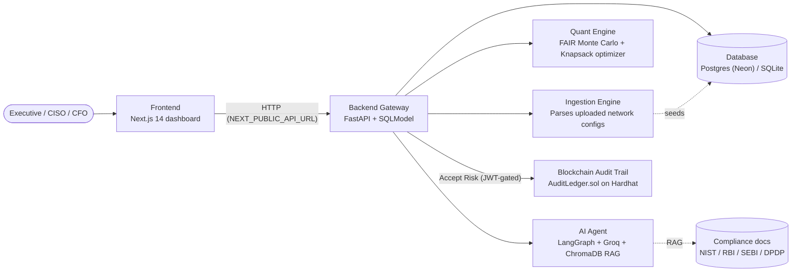

# 🛡️ CRQ Platform — AI-Powered Cyber Risk Quantification

[](https://github.com/Sid-DudeD017/CRQ_Platform)
[](https://github.com/Sid-DudeD017/CRQ_Platform/actions/workflows/ci.yml)


An AI-powered **Cyber Risk Quantification (CRQ)** platform that turns raw network telemetry into financial risk numbers — Annualized Loss Expectancy (ALE) and Value at Risk (VaR) — instead of red/yellow/green heatmaps. Built for Smart India Hackathon 2025.

It bridges enterprise telemetry, **FAIR Monte Carlo risk math**, a **0/1 knapsack budget optimizer**, a **LangGraph-based Virtual CISO** for compliance Q&A, and a **blockchain-backed audit trail** so accepted-risk decisions can't be quietly edited after the fact.

---

## 📋 Table of Contents

- [Architecture Overview](#-architecture-overview)
- [Tech Stack](#-tech-stack)
- [Features](#-features)
- [Project Structure](#-project-structure)
- [Data Model](#-data-model)
- [Getting Started](#-getting-started)
- [Step-by-Step Run Instructions](#️-step-by-step-run-instructions)
- [Environment Variables](#-environment-variables)
- [API Documentation](#-api-documentation)
- [Testing & CI](#-testing--ci)
- [Deployment](#-deployment)
- [Data Lifecycle](#-data-lifecycle)
- [Troubleshooting](#-troubleshooting)
- [Security Notes](#-security-notes)
- [License](#-license)

---

## 🏗️ Architecture Overview



- **Frontend (`/frontend`)** — Next.js 14 executive dashboard: Recharts-driven Monte Carlo distributions, a budget-optimizer sandbox, a blockchain-backed ledger, a compliance training module, and a floating Virtual CISO chat.
- **Backend API (`/backend`)** — FastAPI gateway. Owns the database (SQLite locally, Postgres/Neon in production), JWT auth, mock telemetry generation, the config-ingestion pipeline, and every REST endpoint the frontend calls.
- **Quant Engine (`/quant-engine`)** — `monte_carlo.py` runs a 10,000+ iteration FAIR simulation (triangular-distributed loss magnitude × frequency) to produce ALE, VaR, and a SEBI Cyber Capability Index; `optimizer.py` solves a 0/1 knapsack (via PuLP/CBC) to pick the set of security controls that cuts the most risk per rupee of budget.
- **AI Agent (`/ai-agent`)** — A LangGraph multi-agent "Virtual CISO" (Security Analyst / Compliance Officer / Quant Analyst sub-agents) backed by Groq, with a ChromaDB RAG index over NIST CSF, RBI, SEBI CSCRF, and DPDP Act 2023 reference material.
- **Blockchain (`/blockchain`)** — `AuditLedger.sol`, a Hardhat/Solidity contract. Every "Accept Risk" decision is hashed and committed on-chain, so the ledger is tamper-evident — a local Hardhat node for development, or the Sepolia testnet for a hosted deployment (see [Deployment](#-deployment)).

### Two independent data tracks

The platform keeps **Demo data** and **your own uploaded data** in genuinely separate pools (assets, telemetry, simulations, and mapped ingestion findings are all tagged by `data_source`) — running a simulation in one mode never reads or writes the other's rows. Model training/compliance coverage and the Closed-Loop Calibration Engine are the one exception: they represent real organizational facts, so they stay shared across both modes by design.

---

## 🛠️ Tech Stack

| Layer | Technology |
|---|---|
| Frontend | Next.js 14 (App Router), React 18, TypeScript, Tailwind CSS, Recharts |
| Backend | FastAPI, SQLModel + SQLAlchemy, Pydantic, slowapi (rate limiting) |
| Database | PostgreSQL via [Neon](https://neon.tech) (production) / SQLite (local dev) |
| Auth | JWT (PyJWT), bcrypt password hashing |
| Quant Engine | NumPy, SciPy, PuLP (CBC solver) |
| AI Agent | LangGraph, LangChain, Groq (Llama), ChromaDB (RAG) |
| Blockchain | Solidity, Hardhat, web3.py |
| Testing | pytest, GitHub Actions CI |
| Deployment | Vercel (frontend), Render (backend), Neon (database) |

---

## ✨ Features

| Feature | Description |
|---|---|
| **Demo vs. Own Data** | Run instantly against realistic generated telemetry, or upload your own network configs — kept in fully isolated data pools, switchable anytime without losing either side's history. |
| **Ingestion Engine** | Rule-based parser (`backend/ingestion_engine.py`) that reads uploaded Cisco IOS-style / SONiC configs and finds real, line-addressable security findings (weak SNMP communities, cleartext passwords, missing uRPF/port-security, unauthenticated BGP neighbors, and more) with per-rule confidence scores — not a single hardcoded example mapping. |
| **FAIR Monte Carlo Simulation** | 10,000+ iteration simulation over live telemetry, producing Annualized Loss Expectancy, 95% Value at Risk, a full loss-distribution curve, and a SEBI Cyber Capability Index. |
| **Explainable Risk Attribution** | The dashboard shows the actual control-strength waterfall behind each score — upstream control strength, telemetry deductions, ingestion gap deductions, training boost — not just the final number. |
| **Budget Optimizer** | 0/1 knapsack solver picks the exact set of security controls that maximizes risk reduction per rupee of a given budget. |
| **Blockchain Audit Trail** | Every accepted-risk decision is hashed and committed on-chain (`AuditLedger.sol`), so the ledger can't be quietly edited after the fact. |
| **Virtual CISO (AI Chat)** | LangGraph agent that routes compliance/security/budget questions to specialized sub-agents, backed by a RAG index over real regulatory text (NIST, RBI, SEBI, DPDP). Now requires login. |
| **Closed-Loop Calibration** | Real incident outcomes feed back into the model, narrowing confidence intervals and sharpening future control-effectiveness estimates over time. |
| **Training & Compliance Module** | A standalone module (`/training`) covering security-awareness modules that feed into the Control Strength score, plus a platform navigation guide — independent of picking Demo or Own Data. |
| **Reports & Ledger** | Board-ready report snapshots and a full audit-log ledger, both scoped per data track. |

---

## 📁 Project Structure

```
CRQ_Platform/
│
├── frontend/                       # Next.js 14 dashboard
│   └── src/
│       ├── app/
│       │   ├── overview/           # Demo dashboard (ALE, VaR, loss distribution)
│       │   ├── ingestion/          # Own-data upload + parsed findings (own-data "Overview")
│       │   ├── optimize/           # Budget optimizer sandbox
│       │   ├── ledger/             # Blockchain-backed risk decision ledger
│       │   ├── calibration/        # Closed-loop calibration trends
│       │   ├── reports/            # Board report snapshots
│       │   ├── training/           # Standalone compliance training + nav guide
│       │   ├── docs/ , support/    # In-app documentation & support
│       │   └── page.tsx            # '/' — Home (always; see SharedLayout)
│       ├── components/             # SharedLayout, VirtualCisoChat, CommandPalette, ...
│       ├── context/                # AuthContext, ThemeContext, ToastContext
│       └── lib/                    # api.ts (API_BASE, fetchWithRetry)
│
├── backend/                        # FastAPI gateway
│   ├── main.py                     # All REST endpoints
│   ├── models.py                   # SQLModel tables
│   ├── database.py                 # DB engine + lightweight self-migration
│   ├── risk_engine.py              # FAIR-input derivation, shared by API + AI agent
│   ├── ingestion_engine.py         # Network-config rule parser
│   ├── generators.py               # Mock telemetry + own-data baseline seeding
│   ├── security.py                 # JWT auth, password hashing, demo accounts
│   └── blockchain_client.py        # web3.py client for the Hardhat audit trail
│
├── quant-engine/
│   ├── monte_carlo.py              # FAIR Monte Carlo simulation
│   └── optimizer.py                # 0/1 knapsack budget optimizer (PuLP)
│
├── ai-agent/                       # Virtual CISO
│   ├── graph.py                    # LangGraph multi-agent orchestrator
│   ├── rag.py                      # ChromaDB RAG over compliance docs
│   └── tools.py                    # Tools the agent calls (shares risk_engine math)
│
├── blockchain/                     # Hardhat + Solidity
│   ├── contracts/AuditLedger.sol
│   └── scripts/                    # Deploy scripts
│
├── tests/                          # pytest suite (API, ingestion, Monte Carlo, risk engine)
├── .github/workflows/ci.yml        # Backend tests + frontend lint/build on every push
├── render.yaml                     # Render Blueprint for the backend
└── requirements.txt                # Backend + quant-engine + ai-agent Python deps
```

---

## 🗄️ Data Model

| Table | Purpose |
|---|---|
| `Asset` | Devices/systems in scope, tagged `data_source` (demo vs. own). |
| `TelemetryLog` | Per-asset vulnerability/compromise signals (simulated SIEM/CSPM feed). |
| `NetworkEdge` | Network topology graph for blast-radius calculations. |
| `RiskSimulation` | Stored results of each Monte Carlo run (ALE, VaR, drivers). |
| `RiskDecision` | Accepted-risk audit entries, optionally committed on-chain. |
| `IngestedMapping` | Findings extracted from an uploaded config by the Ingestion Engine. |
| `IncidentRecord` | Real incident outcomes fed into the Closed-Loop Calibration Engine. |
| `CalibrationSnapshot` | Calibration trend over time (uncertainty narrowing, posteriors). |
| `TrainingRecord` | Per-user progress through the compliance training modules. |
| `User` | Real signed-up accounts (bcrypt-hashed passwords), alongside the two hardcoded demo accounts. |

---

## 🚀 Getting Started

### Prerequisites

| Tool | Version | Purpose |
|---|---|---|
| Node.js | v18+ | Frontend |
| Python | 3.10+ | Backend, quant engine, AI agent |
| npm | latest | Frontend package management |
| A Groq API key | free — [console.groq.com/keys](https://console.groq.com/keys) | Virtual CISO agent (`GROQ_API_KEY`) |
| Node.js + npx (optional) | — | Local Hardhat node, for the on-chain audit trail |

An `OPENAI_API_KEY` also works as a fallback if `GROQ_API_KEY` isn't set (see `ai-agent/graph.py`), but costs money — Groq is free and the default.

### 1. Backend Setup

```bash
# From the repo root
python -m venv venv
source venv/bin/activate        # Windows: venv\Scripts\activate

pip install -r requirements.txt

cp backend/.env.example backend/.env
# then edit backend/.env — generate a real SECRET_KEY:
#   openssl rand -hex 32

cp ai-agent/.env.example ai-agent/.env
# then paste your own GROQ_API_KEY into ai-agent/.env
```

### 2. Frontend Setup

```bash
cd frontend
npm install
```

Create `frontend/.env.local` if you're pointing at a non-default backend URL (see [Environment Variables](#-environment-variables)).

---

## 🏃‍♂️ Step-by-Step Run Instructions

Run these in separate terminals from the repo root (backend) and `frontend/` (frontend).

**Terminal 1 — Backend (port 8000)**
```bash
source venv/bin/activate
uvicorn backend.main:app --host 0.0.0.0 --port 8000 --reload
```
✅ Expected: `Uvicorn running on http://0.0.0.0:8000` — Swagger docs at `http://localhost:8000/docs`.

**Terminal 2 — Frontend (port 3000)**
```bash
cd frontend
npm run dev
```
✅ Expected: `Ready on http://localhost:3000`.

**Terminal 3 — Local Hardhat node + contract deployment (optional, for the on-chain audit trail)**
```bash
cd blockchain
npm install                              # first time only
npx hardhat node                         # leave running
```
```bash
# Second terminal, once per fresh node (the node's state resets every
# restart, so redeploy any time you restart `npx hardhat node`):
cd blockchain
npx hardhat run scripts/deploy.js --network localhost
```
The deploy script prints the deployed contract's address, copies its ABI to `backend/AuditLedger.json`, and writes `CONTRACT_ADDRESS=<address>` into `backend/.env` for you — **restart the backend (Terminal 1) afterward** so it picks up the new address. Skipping the deploy step (or forgetting to restart the backend after redeploying) is the most common reason "Accept Risk" logs to the database fine but never shows a transaction hash — `backend/blockchain_client.py::is_available()` falls back to `false` (surfaced on `/api/status` and the workspace-status badge) whenever the node isn't reachable or the contract at `CONTRACT_ADDRESS` doesn't exist yet, and decisions still persist to the database regardless either way.

> **Deploying somewhere hosted (Render, etc.) instead of your own machine?** A hosted backend can't reach a Hardhat node running on your laptop — deploy to the **Sepolia testnet** instead, which needs no locally-running node at all:
> ```bash
> cd blockchain
> cp .env.example .env   # fill in SEPOLIA_RPC_URL + PRIVATE_KEY - see blockchain/.env.example
> npx hardhat run scripts/deploy.js --network sepolia
> ```
> This writes `WEB3_PROVIDER_URL` / `CONTRACT_ADDRESS` / `DEPLOYER_PRIVATE_KEY` into `backend/.env` for you — copy those same three values into your Render service's env vars (already scaffolded in `render.yaml`). See [Deployment](#-deployment) for the full walkthrough.

Open **http://localhost:3000**, sign up or log in, and pick Demo Data, Own Data, or Training on the start screen.

### Demo reset procedure

Before a live demo or a judging session, reset every account's state back to a pristine baseline with `POST /api/reset-demo` (admin/demo accounts only — see `backend/security.py::require_admin`; call it from Swagger at `/docs` while logged in as `ciso`/`cfo`, or `curl -X POST http://localhost:8000/api/reset-demo -H "Authorization: Bearer <admin token>"`). It wipes every own-data fleet, every simulation/decision/incident/training record across every account, then regenerates a fresh shared demo fleet — the same "wipe and reseed" utility documented inline in `backend/main.py::reset_demo`. **Only ever run this against a local or staging backend** (see `docs/STAGING.md`) — never against a production URL with real accounts' data on it.

### Quick end-to-end test

1. **Generate mock telemetry** (Demo mode): `curl -X POST http://localhost:8000/api/generate-mock-data`, or trigger it from Swagger at `/docs`.
2. **Run a simulation**: on `/overview`, adjust the budget slider and click Run Simulation — the backend derives FAIR inputs from telemetry, runs the Monte Carlo engine, and plots the VaR distribution.
3. **Talk to the Virtual CISO**: click the floating chat button (bottom-right, any page) and ask something like *"What are the RBI regulations regarding telemetry?"* — you'll need to be logged in.
4. **Accept a risk decision**: from the sandbox, click Accept Risk. This calls `POST /api/audit`, which now requires a bearer token — see [API Documentation](#-api-documentation).

---

## 🔐 Environment Variables

**`backend/.env`**
```bash
# Leave unset for local dev — defaults to a local SQLite file (crq_db.sqlite3)
DATABASE_URL=postgresql://<user>:<password>@<host>.neon.tech/<dbname>?sslmode=require

SECRET_KEY=<generate with: openssl rand -hex 32>
ALGORITHM=HS256
ACCESS_TOKEN_EXPIRE_MINUTES=60
```

**`ai-agent/.env`**
```bash
GROQ_API_KEY=<your key from console.groq.com/keys>
OPENAI_API_KEY=            # optional fallback, only used if GROQ_API_KEY is unset
```

**`frontend/.env.local`** *(only needed if the backend isn't on `http://localhost:8000`)*
```bash
NEXT_PUBLIC_API_URL=https://your-backend.onrender.com
```

All of the above are gitignored — never commit real values. `backend/.env.example` and `ai-agent/.env.example` are the templates checked into the repo.

---

## 📚 API Documentation

Full interactive docs (Swagger UI) are always available at `/docs` on a running backend (e.g. `http://localhost:8000/docs`).

| Method | Endpoint | Notes |
|---|---|---|
| `POST` | `/api/auth/login` | Demo accounts (`ciso`/`cfo`) or a real signed-up account. Returns a bearer token. |
| `POST` | `/api/auth/signup` | Creates a real account (bcrypt-hashed password), logs it straight in. |
| `POST` | `/api/generate-mock-data` | (Re)generates the Demo-mode telemetry pool. |
| `GET` | `/api/telemetry` | Latest telemetry per asset. |
| `POST` | `/api/upload-telemetry` | Upload a telemetry file. |
| `GET` | `/api/topology` | Network graph for blast-radius calculations. |
| `POST` | `/api/simulate-risk` | Runs the FAIR Monte Carlo simulation; `data_source` selects Demo vs. Own Data. |
| `GET` | `/api/simulations` | Simulation history, filterable by `data_source`. |
| `POST` | `/api/ingest/parse` | Parses an uploaded config, returns candidate findings. |
| `POST` | `/api/ingest/confirm` | Confirms findings into `IngestedMapping` (own-data only). |
| `GET` | `/api/ingest/mappings` | Confirmed ingestion findings. |
| `POST` / `GET` | `/api/training/complete`, `/api/training/progress` | Compliance training progress. |
| `POST` / `GET` | `/api/incidents` | Real incident records feeding the calibration engine. |
| `GET` | `/api/calibration` | Current calibration snapshot + trend. |
| `POST` | `/api/chat` | **Requires auth.** Streams a Virtual CISO response. |
| `POST` | `/api/audit` | **Requires auth.** Accepts a risk decision; acting user comes from the token, not the request body. |
| `GET` | `/api/audit-log` | Ledger entries, filterable by `data_source`. |
| `POST` | `/api/audit-log/{decision_id}/commit-chain` | Commits a decision on-chain. |
| `DELETE` | `/api/audit-log` | Clears the ledger for a `data_source`. |

**Example — log in, then accept a risk decision:**
```bash
# 1. Log in, get a token
curl -X POST http://localhost:8000/api/auth/login -d "username=ciso&password=demo-ciso-pass"

# 2. Call a protected endpoint with it
curl -X POST http://localhost:8000/api/audit \
  -H "Authorization: Bearer <token from step 1>" \
  -H "Content-Type: application/json" \
  -d '{"action": "accept_risk", "risk_accepted": 50000}'
```

Demo credentials (swap for real accounts before this is anything but a hackathon demo — see `backend/security.py`):

| username | password |
|---|---|
| `ciso` | `demo-ciso-pass` |
| `cfo` | `demo-cfo-pass` |

---

## 🧪 Testing & CI

```bash
pytest -v
```

`tests/` covers the API (`test_api.py`), the ingestion rule parser, the Monte Carlo engine, and the risk engine — all offline, no API keys or live services needed (`test_api.py` forces a throwaway SQLite DB and disables the real Groq call). GitHub Actions (`.github/workflows/ci.yml`) runs this suite plus a frontend lint + build on every push to `main` and every pull request.

---

## ☁️ Deployment

The hosted demo runs the **frontend on Vercel**, the **backend on Render**, backed by a **Neon Postgres** database. `render.yaml` is a Render Blueprint defining *two* independent services — `crq-platform-backend` (production) and `crq-platform-backend-staging` — so destructive/seed operations can be tested against staging without ever touching production data (see [Data Lifecycle](#-data-lifecycle) and `docs/STAGING.md`). In the Render dashboard, choose *New → Blueprint*, connect this repo, and it pre-fills both services; you paste in each one's own `DATABASE_URL` and `GROQ_API_KEY` yourself, and Render auto-generates a real `SECRET_KEY` for each. Each service also sets `ENVIRONMENT` (`production`/`staging`), echoed back by `GET /api/status` so you can always confirm which deployment you're actually talking to.

The on-chain audit trail defaults to a local Hardhat node, which a hosted backend can't reach — but it doesn't have to run locally-only. Deploy `AuditLedger.sol` to the **Sepolia testnet** instead (free, no server of your own required):

```bash
cd blockchain
cp .env.example .env
# fill in .env:
#   SEPOLIA_RPC_URL - a free Sepolia RPC endpoint, e.g.
#     https://ethereum-sepolia-rpc.publicnode.com (no signup), or an
#     Alchemy/Infura free-tier key for more reliable uptime
#   PRIVATE_KEY - a fresh, testnet-only wallet funded with a little Sepolia
#     ETH from a faucet (e.g. https://www.alchemy.com/faucets/ethereum-sepolia) -
#     never a wallet holding real funds
npx hardhat run scripts/deploy.js --network sepolia
```

This prints the deployed address and writes `WEB3_PROVIDER_URL` / `CONTRACT_ADDRESS` / `DEPLOYER_PRIVATE_KEY` into `backend/.env` — copy that same set of three values into each Render service's env vars (`render.yaml` already lists them, `sync: false`, so the dashboard prompts for them like it does `DATABASE_URL`/`GROQ_API_KEY`). Give production and staging **separate** contract deployments (redeploy once more for staging) so staging's test clicks never land in production's ledger — see `docs/STAGING.md`. Leave all three unset and the hosted backend behaves as it did before: `/api/status` reports the ledger "unavailable" and accepted-risk decisions still persist to the database, just without a transaction hash.

> Remember: Vercel/Render only rebuild from what's pushed to GitHub. After merging changes locally, push to `main` (and trigger a redeploy if it isn't set to auto-deploy) before expecting the live site to reflect them.

---

## 🗃️ Data Lifecycle

What's implemented in code vs. what's an operational recommendation for wherever this is actually deployed:

**Implemented (self-service, in the app):**
- `GET /api/account/export` — returns every row your account owns (assets, telemetry, simulations, risk decisions, ingested mappings, incident records, training completions, chat feedback ratings) as one JSON document.
- `DELETE /api/account` (with `{"confirm": true}`) — permanently deletes all of the above, plus your account itself for a real (non-demo) account. Irreversible — export first if you want a copy.
- `POST /api/admin/purge-stale-data` (admin-only) — deletes `TelemetryLog`/`RiskSimulation` rows older than a configurable window (default 365 days). **Never** touches `RiskDecision` (the audit ledger) or `IncidentRecord` (calibration ground truth) — see `backend/retention.py`'s docstring for why those are excluded on purpose. Nothing schedules this automatically; run it from an external cron (`curl -X POST .../api/admin/purge-stale-data -H "Authorization: Bearer $ADMIN_TOKEN"`) if you want it to run on a schedule.
- `backend/database.py::init_db()` auto-migrates additively on every startup (`_add_missing_columns`/`_add_missing_indexes`) — safe for adding a nullable column or an index to an existing table, but it will never rename or drop a column. A genuinely destructive schema change (renaming/removing a column, changing a type) needs a one-off manual migration script — there's no Alembic in this project yet.
- Full data-handling policy, in plain language: [`docs/PRIVACY.md`](docs/PRIVACY.md).

**Operational recommendations (infrastructure-dependent, not code in this repo):**
- **Backups** — local/demo SQLite: `sqlite3 crq_db.sqlite3 ".backup backup-$(date +%F).sqlite3"` on a nightly cron, keeping the last N days. Neon Postgres (production): Neon has built-in point-in-time recovery — no extra setup needed, but confirm the retention window on your plan.
- **Restore testing** — periodically restore the latest backup into a scratch database and run `init_db()` against it, then spot-check row counts against the source. Not automated by anything in this repo; worth a recurring calendar reminder for a real deployment.
- **Retention policy for backups themselves** — pick a window (e.g. 30 days of nightly SQLite backups, or whatever your Neon plan's PITR window is) and document it alongside `docs/PRIVACY.md` if this ever handles real user data at scale.

---

## 🐛 Troubleshooting

| Issue | Solution |
|---|---|
| `address already in use` on port 8000/3000 | Kill the process on that port, or change the port in the run command. |
| Simulation returns no data / "no assets found" | Run `POST /api/generate-mock-data` first (Demo mode), or upload + confirm a config (Own Data mode). |
| Virtual CISO chat says please log in | `/api/chat` requires a bearer token — log in first. |
| `GROQ_API_KEY` missing | Chat falls back to `OPENAI_API_KEY` if set; otherwise the agent can't respond. |
| CORS error in the browser console | Check `NEXT_PUBLIC_API_URL` in `frontend/.env.local` matches where the backend is actually running. |
| Accept Risk / commit-chain fails | Local dev: the Hardhat node (`npx hardhat node` in `blockchain/`) isn't running. Hosted: `WEB3_PROVIDER_URL`/`CONTRACT_ADDRESS`/`DEPLOYER_PRIVATE_KEY` aren't set to a deployed Sepolia contract yet, or `DEPLOYER_PRIVATE_KEY` doesn't match the wallet that deployed it (check the backend's startup logs for a `[blockchain_client]` warning). Either way, decisions still save to the database regardless. |

---

## 🔒 Security Notes

- Passwords for real (non-demo) accounts are bcrypt-hashed, never stored in plaintext.
- `/api/chat` and `/api/audit` require a valid bearer token; the acting user is read from the token, not the request body.
- `fetchWithRetry` (frontend) only retries on network errors/5xx responses and forces a clean logout on a 401, instead of retrying or silently failing on bad credentials.
- Demo vs. Own Data are isolated at the query level — a demo run never reads or writes your uploaded data's rows, and vice versa.
- `backend/.env` and `ai-agent/.env` are gitignored; only `.env.example` templates (with placeholder values) are committed.
- Full risk register (uploaded configs, AI prompt injection, cross-tenant access, audit tampering, blockchain failures, exposed credentials, malicious telemetry, unauthorized approvals): [`docs/THREAT_MODEL.md`](docs/THREAT_MODEL.md).

---

## 📄 License

No license file has been added to this repository yet — all rights reserved by default until one is chosen (MIT is a common choice for hackathon projects; add a `LICENSE` file to make usage terms explicit).

---

## 🙏 Acknowledgments

Built for **Smart India Hackathon 2025** — an AI-powered platform for quantifying cyber risk in financial terms rather than qualitative heatmaps, aligned to NIST CSF, RBI, SEBI CSCRF, and the DPDP Act 2023.

**Repository:** https://github.com/Sid-DudeD017/CRQ_Platform
